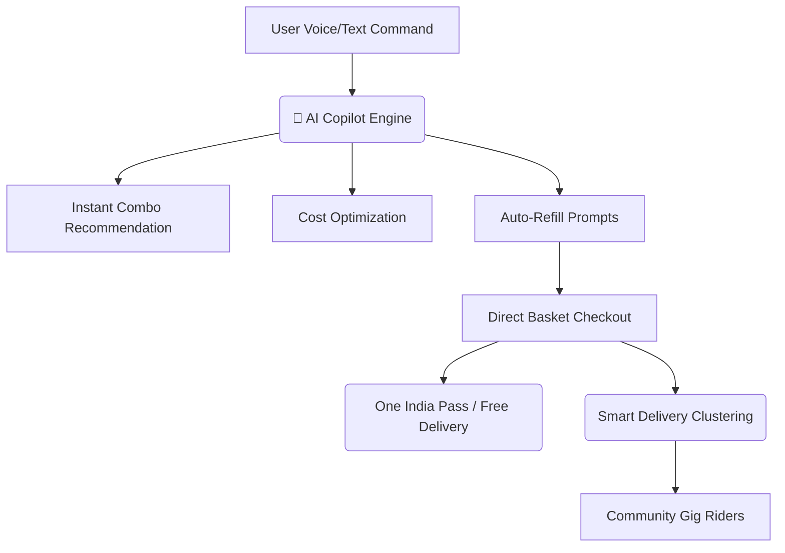

# 🚀 Velto: The AI-First Hyperlocal Super App
*Pitch Deck Framework, Product Features, and Market Differentiators*

---

## 1. Executive Summary & Vision
**Velto** is the next evolution of quick commerce. Instead of a traditional search-and-add storefront, Velto is an **AI-first Hyperlocal Super App** that aggregates groceries, hot food, tiffin plans, pharmacy, courier logistics, utility recharges, and home bookings into a single, unified interface driven by voice and predictive automation.

* **Tagline**: *Don't search for items. Ask Velto.*
* **The Goal**: To reduce shopping time by 90%, cut delivery costs via neighborhood clustering, and capture the massive Indian household wallet with unified, high-frequency services.

---

## 2. The Problem with Current Q-Commerce (Zepto, Blinkit, Instamart)
1. **App Fatigue & Fragmentation**: Users switch between 3 to 4 apps to order groceries, dinner, courier packets, and book home cleaners.
2. **Friction-Filled Search**: Buying ingredients for a recipe requires searching and adding 10 individual items manually.
3. **Weak Unit Economics**: High delivery burn due to single-rider point-to-point dispatches with zero community pooling.
4. **Frustrating Customer Support**: Refunding a missing or damaged item takes 15 minutes of arguing with customer support agents.
5. **Ignore the Indian Student & Family Demographics**: No shared wallets, no specialized campus modes, and no recurring home-style meal plans.

---

## 3. The Velto Solution
Velto reimagines hyperlocal delivery by injecting AI at every layer of the transaction—from shopping to logistics, checkouts, and refunds.

---

## 4. Feature-by-Feature Pitch Blueprint

### 🤖 Feature 1: AI Shopping Copilot
* **What it does**: Users type or speak intent-based commands (e.g. *"Make breakfast for 4 people under ₹300"*). The AI instantly identifies ingredients, matches prices, suggests cost-saving swaps, builds the cart, and applies group combos.
* **Why it's a game changer**: Eliminates search filters entirely. Converts browsing time into immediate checkouts.

### 🎙️ Feature 2: Voice Commerce (Chai-Time & Past Order Shortcuts)
* **What it does**: Native voice processing designed for Indian users. Speaking shortcuts like *"Order my usual groceries"* immediately maps historic baskets and completes payment in under 3 seconds.
* **Why it's a game changer**: Highly accessible for elderly users, busy homemakers, and non-English speakers.

### 🎓 Feature 3: Student Mode & Night Canteen
* **What it does**: A specialized portal toggle designed for college hostels. Unlocks cheap midnight combos (e.g. *Maggie + Cold Drink* packs) and allows shared neighborhood orders for dormitory rooms.
* **Why it's a game changer**: Low customer acquisition cost (CAC) and virality across university campuses.

### 📦 Feature 4: Smart Neighborhood Clustering & Community Riders
* **What it does**: Allows users in the same sector or building to pool deliveries (e.g., *"Wait 8 mins and save ₹40"*). It also matches orders to local micro-gig riders (students on cycles or shopkeepers walking nearby).
* **Why it's a game changer**: Drastically reduces carbon footprint and delivery cost, turning shipping fees from a cost center into a shared saving.

### 📅 Feature 5: Recurring Tiffin Subscription Plans
* **What it does**: Integrated subscription meal plans (delivered hot daily) managed directly in the app.
* **Why it's a game changer**: Traditional quick commerce apps only do grocery or restaurant delivery. Velto bridges the gap by offering recurring, daily home-cooked fulfillment, locking in customer lifetime value (LTV).

### 🛡️ Feature 6: AI Auto-Refund Engine
* **What it does**: An instant, single-click refund trigger next to completed orders. If an item is missing or damaged, the user reports it to the AI, which instantly processes, approves, and credits their Velto Wallet.
* **Why it's a game changer**: Eradicates customer support overhead and builds massive trust.

### 👑 Feature 7: One India Pass
* **What it does**: A flat-rate subscription purchased at checkout that unlocks free deliveries for 1 month, while keeping the platform safety fee intact.
* **Why it's a game changer**: Boosts order frequency while safeguarding transaction unit economics.

---

## 5. Differentiators: Velto vs. Legacy Competitors

| Metric / Feature | Legacy Apps (Blinkit, Zepto, Instamart) | Velto Super App |
| :--- | :--- | :--- |
| **Search Mechanism** | Manual, catalog-based search filters | **AI Conversational Copilot** (Text/Voice) |
| **Service Scope** | Grocery only (or food on a separate app) | **Unified Hub** (Groceries + Kitchen + Tiffins + Pharmacy + Services) |
| **Logistics Model** | Dedicated company-managed vehicle riders | **Smart Clustering** + **Community Gig Partners** (Students/Shopkeepers) |
| **Subscription Plan** | Delivery passes that burn platform margins | **One India Pass** (Free delivery only, platform fees preserved) |
| **Refund Process** | Lengthy human agent chat reviews | **Instant AI Auto-Refund Engine** (Immediate wallet credit) |
| **Engagement** | Transactional, discount-driven notifications | **Mood-Based Ordering & Refill Predictions** (High-emotional engagement) |

---

## 6. Business Model & Unit Economics
1. **SaaS Commission**: Charging commissions on cloud kitchen partners, home service specialists, and local merchant sales.
2. **Subscription Revenue**: Steady cash flow from the **One India Pass** monthly subscriptions.
3. **Advertising & Placement**: Premium placement of products during AI Copilot recommendations.
4. **Logistics Efficiencies**: Delivery clustering increases drops-per-hour (DPH) from 2.1 to 4.5, cutting last-mile overhead by 45%.
